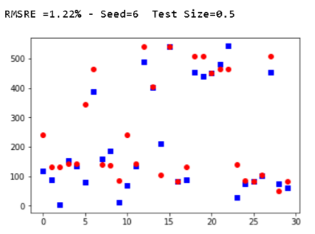
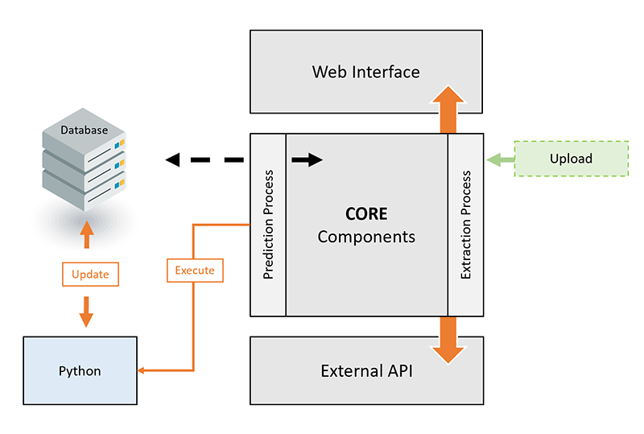

PDB Predictive Maintenance Analytics  
-------------------
# Project Objectives
  - Predicting the “Mean Time Before Failure” (MTBF) of the equipment before it break down
  - Predict how much time left before it breaks down
  - Prescribe at what time the action is required for the specific equipment



## Prediction Process




# Instalation
 
#### 1. Make sure you install [Web Server](https://www.digitalocean.com/community/tutorials/how-to-install-linux-apache-mysql-php-lamp-stack-on-ubuntu-16-04) 
#### 2. Create GitHun personal [API token](https://github.com/blog/1509-personal-api-tokens)
#### 3. Make sure you install [Composer](http://getcomposer.org/) 
#### 4. Prepare project
 
     $ git clone git@bitbucket.org:nemadaliev/petronas_web.git 
     $ cd petronas_web
     $ composer install
     $ php init
          
#### 5. Install DB ("db.mysql" provided inside src)
> **Note:** Initial data has already few records. 

Users

user: admin
password: admin123321
#### 6. Modification of the config file 
(../petronas_web/common/config/main-local.php)

      return [
          'components' => [
              'db' => [
                  'class' => 'yii\db\Connection',
                  'dsn' => 'mysql:host=localhost;dbname=db_name',
                  'username' => '',
                  'password' => '',
                  'charset' => 'utf8',
              ],
              ....
          ],
      ];
      
#### 7. Recommended Apache Configuration. 
  Use the following configuration in Apache's httpd.conf file or within a virtual host configuration. Note that you should replace path/to/basic/web with the actual path for basic/web.
      ```php
        
         <VirtualHost *:80>
                 ServerName example.com
                 DocumentRoot "path/to/basic/petronas_web"
                 <Directory "path/to/basic/petronas_web">
                     # use mod_rewrite for pretty URL support
                     RewriteEngine on
                     # If a directory or a file exists, use the request directly
                     RewriteCond %{REQUEST_FILENAME} !-f
                     RewriteCond %{REQUEST_FILENAME} !-d
                     # Otherwise forward the request to index.php
                     RewriteRule . index.php
                 
                     # if $showScriptName is false in UrlManager, do not allow accessing URLs with script name
                     RewriteRule ^index.php/ - [L,R=404]
                 
                     # ...other settings...
                 </Directory>
         </VirtualHost>
      ```
  
This project used Yii 2 Advanced Project Template is a skeleton [Yii 2](http://www.yiiframework.com/) application best for
developing complex Web applications with multiple tiers.

The template includes three tiers: front end, back end, and console, each of which
is a separate Yii application.

The template is designed to work in a team development environment. It supports
deploying the application in rterte environments.

Documentation is at [docs/guide/README.md](docs/guide/README.md).

[](https://packagist.org/packages/yiisoft/yii2-app-advanced)
[](https://packagist.org/packages/yiisoft/yii2-app-advanced)
[](https://travis-ci.org/yiisoft/yii2-app-advanced)

##  Modules
There are few moduls, backend and frontend is main modules. **Backend** is for panel management. 
Frontend is public website. 

DIRECTORY STRUCTURE
-------------------

```
common
    config/              contains shared configurations
    mail/                contains view files for e-mails
    models/              contains model classes used in both backend and frontend
    tests/               contains tests for common classes    
console
    config/              contains console configurations
    controllers/         contains console controllers (commands)
    migrations/          contains database migrations
    models/              contains console-specific model classes
    runtime/             contains files generated during runtime
backend
    assets/              contains application assets such as JavaScript and CSS
    config/              contains backend configurations
    controllers/         contains Web controller classes
    models/              contains backend-specific model classes
    runtime/             contains files generated during runtime
    tests/               contains tests for backend application    
    views/               contains view files for the Web application
    web/                 contains the entry script and Web resources
python
    predict.py           Main file to proceed prediction 
frontend
    assets/              contains application assets such as JavaScript and CSS
    config/              contains frontend configurations
    controllers/         contains Web controller classes
    models/              contains frontend-specific model classes
    runtime/             contains files generated during runtime
    tests/               contains tests for frontend application
    views/               contains view files for the Web application
    web/                 contains the entry script and Web resources
    widgets/             contains frontend widgets
vendor/                  contains dependent 3rd-party packages
environments/            contains environment-based overrides
```
